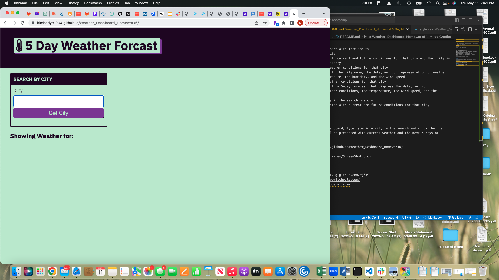

# Weather_Dashboard_Homework6
Weather_Dashboard_Homework6


## Weather_Dashboard_Homework6

- My motivation in building a Weather Dashboard is to get better at JavaScripting.
- I built this Weather Dashboard to allow someone to search for the city and see the current weather and the next 5 days.
- I learned a little JavaScripting.

## User Story
```
AS A traveler
I WANT to see the weather outlook for multiple cities
SO THAT I can plan a trip accordingly
```

## Acceptance Criteria

```
GIVEN a weather dashboard with form inputs
WHEN I search for a city
THEN I am presented with current and future conditions for that city and that city is added to the search history
WHEN I view current weather conditions for that city
THEN I am presented with the city name, the date, an icon representation of weather conditions, the temperature, the humidity, and the wind speed
WHEN I view future weather conditions for that city
THEN I am presented with a 5-day forecast that displays the date, an icon representation of weather conditions, the temperature, the wind speed, and the humidity
WHEN I click on a city in the search history
THEN I am again presented with current and future conditions for that city
```

## Usage

To use the Weather Dashboard, type type in a city to the search and click the "get city" button. You will be presented with current weather and the next 5 days of weather forcast.

https://kimberlyc1904.github.io/Weather_Dashboard_Homework6/



## Credits

Erwin Jocosing Student. @ github.com/ej619
W3 Schools https://www.w3schools.com/
ChatGPT https://chat.openai.com/
